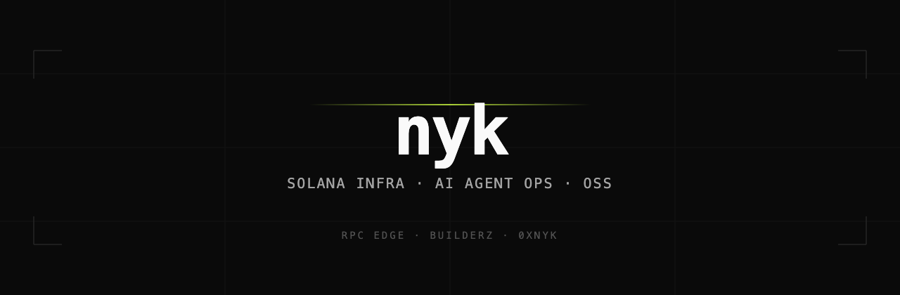

**Co-Founder @ [rpc edge](https://rpcedge.com)** — low-latency Solana infrastructure for high-frequency trading.

Open-source builder across AI agent ops, developer tools, and Solana.  
Previously founded [Builderz](https://builderz.dev).

  
  
  
  
  

---

I build at the intersection of **Solana infrastructure** and **AI agent operations** — **14k+ GitHub stars** across open source, plus code landed upstream in [Hermes Agent](https://github.com/NousResearch/hermes-agent). By day: [rpc edge](https://rpcedge.com). The rest is open source.

## What I'm building now

**[rpc edge](https://rpcedge.com)** — low-latency Solana infrastructure for high-frequency trading. Dedicated RPC, Yellowstone gRPC, decoded shred streams, and a transaction sender — co-located with the cluster and the Jito Block Engine. Metered bandwidth, self-serve, settled in USDC on Solana. _By Polaris Labs._

→ [rpcedge.com](https://rpcedge.com) · [docs.rpcedge.com](https://docs.rpcedge.com)

**Open source shipping alongside it:**

| Project | One-liner | Stars |
|---|---|---|
| [mission-control](https://github.com/builderz-labs/mission-control) | Agent fleet dashboard |  |
| [council-of-high-intelligence](https://github.com/0xNyk/council-of-high-intelligence) | Multi-perspective reasoning skill |  |
| [awesome-hermes-agent](https://github.com/0xNyk/awesome-hermes-agent) | Curated Hermes Agent ecosystem list |  |
| [lacp](https://github.com/0xNyk/lacp) | Local agent control plane |  |
| [silo](https://github.com/0xNyk/silo) | Isolated Claude Code profiles (`CLAUDE_CONFIG_DIR`) |  |
| [unmachined](https://github.com/0xNyk/unmachined) | Anti-AI-slop skill for text + UI |  |

**Upstream:** contributor to [**Hermes Agent**](https://github.com/NousResearch/hermes-agent) (Nous Research) — cron/timezone fix on `main` via [co-authored commit](https://github.com/NousResearch/hermes-agent/commit/605ba4adea51af2580f1ab94fd6372e873c108e7), plus [open PRs](https://github.com/NousResearch/hermes-agent/pulls?q=author%3A0xNyk) for session continuity, skills, and subagent isolation. Also proposing fixes to [OpenClaw](https://github.com/openclaw/openclaw/pulls?q=author%3A0xNyk).

## What I believe

- Infrastructure wins on **latency, reliability, and sharp defaults**.
- Agent teams need **operations**, not demos.
- The strongest stack is **open-core control plane + premium operator UX**.

## Build surface

  

## Selected open-source work

Star counts are live.

| Project | What it does | Stars |
|---|---|---|
| [mission-control](https://github.com/builderz-labs/mission-control) | Agent fleet dashboard — tasks, quality gates, cost tracking, real-time orchestration |  |
| [awesome-hermes-agent](https://github.com/0xNyk/awesome-hermes-agent) | Curated skills, tools, and integrations for the Hermes Agent ecosystem (Nous Research) |  |
| [council-of-high-intelligence](https://github.com/0xNyk/council-of-high-intelligence) | Multi-perspective reasoning skill — historical thinkers deliberate on your problem |  |
| [marketing-dashboard](https://github.com/builderz-labs/marketing-dashboard) | Marketing ops control center for AI agent teams — CRM, outreach, content, analytics |  |
| [lacp](https://github.com/0xNyk/lacp) | Local Agent Control Plane — policy gates, memory layers, hook pipeline |  |
| [xint](https://github.com/0xNyk/xint) | X intelligence CLI (TypeScript + Bun) — search, monitor, analyze, engage |  |
| [silo](https://github.com/0xNyk/silo) | Isolated Claude Code profiles via `CLAUDE_CONFIG_DIR` — no credential vault swap |  |
| [unmachined](https://github.com/0xNyk/unmachined) | Anti-AI-slop agent skill — text and UI that reads written, not generated |  |
| [awesome-agent-cortex](https://github.com/0xNyk/awesome-agent-cortex) | Sovereign agent stack — scripts, on-chain identity, knowledge graphs |  |
| [builderz-solana-dapp-scaffold](https://github.com/builderz-labs/builderz-solana-dapp-scaffold) | Production-ready Solana dApp starter (Next.js, Tailwind, web3.js) |  |

<b>More open-source repositories</b> — most-starred first

 

| Project | What it does | Stars |
|---|---|---|
| [pretext-playground](https://github.com/0xNyk/pretext-playground) | Interactive ASCII dragon playground with @chenglou/pretext |  |
| [openclaw-to-hermes](https://github.com/0xNyk/openclaw-to-hermes) | Migration tool from OpenClaw to Hermes Agent |  |
| [xint-rs](https://github.com/0xNyk/xint-rs) | X intelligence CLI as a single Rust binary — &lt;5ms startup |  |
| [builderz-xNFT-scaffold-next](https://github.com/builderz-labs/builderz-xNFT-scaffold-next) | Solana xNFT scaffold (Next.js, TypeScript, Tailwind) |  |
| [solana-claude-md](https://github.com/builderz-labs/solana-claude-md) | Open-source CLAUDE.md pack for Solana program work |  |
| [hermes-cf-bypass](https://github.com/0xNyk/hermes-cf-bypass) | Cloudflare TLS fingerprint bypass for Hermes on datacenter VPS |  |
| [agent-run](https://github.com/builderz-labs/agent-run) | Open standard for agent observability |  |
| [anon-pay](https://github.com/builderz-labs/anon-pay) | Front-end for Elusiv private payments on Solana |  |
| [renaissance-xnft](https://github.com/builderz-labs/renaissance-xnft) | Royalty tracking and redemption for NFT communities |  |
| [builderz-royalty-redemption-program](https://github.com/builderz-labs/builderz-royalty-redemption-program) | Solana program for royalty redemptions |  |
| [truthlens](https://github.com/0xNyk/truthlens) | Privacy-first AI content authenticity detector |  |
| [obsidian-curator](https://github.com/0xNyk/obsidian-curator) | Deterministic knowledge-graph maintenance for Claude + Obsidian |  |
| [homebrew-xint](https://github.com/0xNyk/homebrew-xint) | Homebrew tap for xint and xint-rs |  |
| [serverless-merch](https://github.com/0xNyk/serverless-merch) | Community merch with no backend server |  |
| [transmuter](https://github.com/0xNyk/transmuter) | Swap, merge, split, and breed NFTs on Solana |  |

## Connect

| | |
|---|---|
| **rpc edge** | [rpcedge.com](https://rpcedge.com) · [@rpcedge](https://x.com/rpcedge) · [docs](https://docs.rpcedge.com) |
| **Personal** | [nyk.dev](https://nyk.dev) · [@nyk_builderz](https://x.com/nyk_builderz) |
| **Previously** | founded [Builderz](https://builderz.dev) |

## Support

If this open-source work is useful:

**Solana:** `2k1oq9U99mwy4gm8P2hXPJoZusoXQCpFs35EEf5Ve73y`
