

<picture>
  <!-- A README renders in the VIEWER's theme. The ink banner bleeds to true
       black so it dissolves into dark chrome; on a white README that same
       bleed becomes a hard rectangle, so light mode gets the paper register. -->
  <source media="(prefers-color-scheme: dark)" srcset="assets/banner.png?v=achroma-v5">
  <source media="(prefers-color-scheme: light)" srcset="assets/banner-light.png?v=achroma-v5">
  
</picture>

**Agents fail on the harness, not the model.**  
Agent operating systems, Solana infrastructure, open source.  
Personal brand / hub: [nyk.dev](https://nyk.dev) · GitHub: [github.com/0xNyk](https://github.com/0xNyk)

Ventures under the name: co-founder [rpc edge](https://rpcedge.com) · founded [Builderz](https://builderz.dev) · selective consulting.

  
  
  
  
  
  
  

  <a href="https://nyk.dev/consulting#packages"><b>Fixed-scope packages →</b></a> ·
  <a href="https://nyk.dev/products/agent-os-kit">Agent OS Kit</a> ·
  <a href="https://nyk.dev">Field notes</a>

---

I build the **ops layer for AI agent fleets** - quotas, safety gates, orchestration, control planes - and prove it in daily use: my ventures run on the same agent stack I open-source, down to the live star counts on this page. <!-- oss-total -->**16.3K+ OSS stars** (16,302 live across every repo I have authored, listed on this page)<!-- /oss-total -->, code upstream in [Hermes Agent](https://github.com/NousResearch/hermes-agent). [rpc edge](https://rpcedge.com) is the Solana infrastructure venture; the rest is public tooling people use.

## What I'm building now

**[rpc edge](https://rpcedge.com)** - low-latency Solana infrastructure for high-frequency trading. Dedicated RPC, Yellowstone gRPC, decoded shred streams, and a transaction sender - co-located with the cluster and the Jito Block Engine. Metered bandwidth, self-serve, settled in USDC on Solana. _By Polaris Labs._

Open tooling for the same stack:

| Repo | What it is |
|---|---|
| [rpcedge-toolkit](https://github.com/rpc-edge/rpcedge-toolkit) | TypeScript SDK, CLI, and MCP server for Solana trading infrastructure |
| [rpcedge-copy-ref](https://github.com/rpc-edge/rpcedge-copy-ref) | Paper copy-watch reference - doctor → poll wallet → paper log (not financial advice) |
| [rpcedge-dlmm-ref](https://github.com/rpc-edge/rpcedge-dlmm-ref) | Paper Meteora DLMM pool-watch reference - doctor → accountSubscribe → paper log (not financial advice) |

→ [rpcedge.com](https://rpcedge.com) · [docs.rpcedge.com](https://docs.rpcedge.com) · [toolkit](https://rpcedge.com/toolkit)

**Latest open source (shipping):**

| Project | One-liner | Stars |
|---|---|---|
| [rpcedge-toolkit](https://github.com/rpc-edge/rpcedge-toolkit) | TypeScript SDK, CLI, and MCP server for rpc edge / Solana trading infra |  |
| [rpcedge-copy-ref](https://github.com/rpc-edge/rpcedge-copy-ref) | Minimal paper copy-watch reference for rpc edge (doctor → poll → paper log) |  |
| [rpcedge-dlmm-ref](https://github.com/rpc-edge/rpcedge-dlmm-ref) | Paper Meteora DLMM pool-watch reference for rpc edge (not financial advice) | [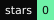](https://github.com/rpc-edge/rpcedge-dlmm-ref/stargazers) |
| [hermes-buzz](https://github.com/0xNyk/hermes-buzz) | Hermes Agent × Buzz starter kit (buzz-acp + hermes-acp onboarding)| [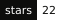](https://github.com/0xNyk/hermes-buzz/stargazers) |
| [llmquota](https://github.com/0xNyk/llmquota) | Terminal roster for LLM CLI quotas - see usage, reset times, and which agent still has headroom | [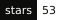](https://github.com/0xNyk/llmquota/stargazers) |
| [agent-security](https://github.com/0xNyk/agent-security) | Safety gates for agent-touched repos - scan leaks, vet code, trip on prompt injection, guard destructive ops | [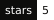](https://github.com/0xNyk/agent-security/stargazers) |
| [silo](https://github.com/0xNyk/silo) | Isolated Claude Code profiles via `CLAUDE_CONFIG_DIR` - no credential vault swap | [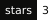](https://github.com/0xNyk/silo/stargazers) |
| [unmachined](https://github.com/0xNyk/unmachined) | Anti-AI-slop skill - text + UI that reads written, not generated | [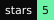](https://github.com/0xNyk/unmachined/stargazers) |

**Upstream:** contributor to [**Hermes Agent**](https://github.com/NousResearch/hermes-agent) (Nous Research) - cron/timezone fix on `main` via [co-authored commit](https://github.com/NousResearch/hermes-agent/commit/605ba4adea51af2580f1ab94fd6372e873c108e7), plus [open PRs](https://github.com/NousResearch/hermes-agent/pulls?q=author%3A0xNyk) for session continuity, skills, and subagent isolation. Also proposing fixes to [OpenClaw](https://github.com/openclaw/openclaw/pulls?q=author%3A0xNyk).

## Work with me

Fixed scope, fixed price band, agreed before anything starts. You get the system
and the handoff, not a dependency on me.

| | | |
|---|---|---|
| **Agent Reliability Audit** | 2 weeks · from $4K | Trajectory evals that locate where your agents actually fail, plus a fix list in priority order |
| **Agent OS Setup** | 2-4 weeks · from $5K | A working agent stack your team can run without me |
| **Solana infra** | 2-6 weeks · from $8K | Latency-sensitive execution paths, data and transaction sending |
| **Agent OS Kit** | €149 · instant | The controls as editable files, if you would rather install it yourself |

→ [See all packages](https://nyk.dev/consulting#packages) · [Book a 30-min intro](https://nyk.dev/contact)

## Selected open-source work

**Top 10 by stars.** Live badges. Profile: [github.com/0xNyk](https://github.com/0xNyk).

| # | Project | What it does | Stars |
|---|---|---|---|
| 1 | [mission-control](https://github.com/builderz-labs/mission-control) | Agent fleet dashboard - tasks, quality gates, cost tracking, real-time orchestration | [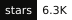](https://github.com/builderz-labs/mission-control/stargazers) |
| 2 | [awesome-hermes-agent](https://github.com/0xNyk/awesome-hermes-agent) | Curated skills, tools, and integrations for the Hermes Agent ecosystem (Nous Research) | [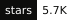](https://github.com/0xNyk/awesome-hermes-agent/stargazers) |
| 3 | [council-of-high-intelligence](https://github.com/0xNyk/council-of-high-intelligence) | Multi-perspective reasoning skill - historical thinkers deliberate on your problem | [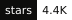](https://github.com/0xNyk/council-of-high-intelligence/stargazers) |
| 4 | [marketing-dashboard](https://github.com/builderz-labs/marketing-dashboard) | Marketing ops control center for AI agent teams - CRM, outreach, content, analytics | [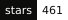](https://github.com/builderz-labs/marketing-dashboard/stargazers) |
| 5 | [lacp](https://github.com/0xNyk/lacp) | Local Agent Control Plane - policy gates, memory layers, hook pipeline | [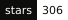](https://github.com/0xNyk/lacp/stargazers) |
| 6 | [xint](https://github.com/0xNyk/xint) | X intelligence CLI (TypeScript + Bun) - search, monitor, analyze, engage | [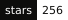](https://github.com/0xNyk/xint/stargazers) |
| 7 | [awesome-agent-cortex](https://github.com/0xNyk/awesome-agent-cortex) | Sovereign agent stack - scripts, on-chain identity, knowledge graphs | [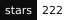](https://github.com/0xNyk/awesome-agent-cortex/stargazers) |
| 8 | [builderz-solana-dapp-scaffold](https://github.com/builderz-labs/builderz-solana-dapp-scaffold) | Production-ready Solana dApp starter (Next.js, Tailwind, web3.js) | [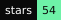](https://github.com/builderz-labs/builderz-solana-dapp-scaffold/stargazers) |
| 9 | [openclaw-to-hermes](https://github.com/0xNyk/openclaw-to-hermes) | Battle-tested migration from OpenClaw to Hermes Agent | [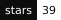](https://github.com/0xNyk/openclaw-to-hermes/stargazers) |
| 10 | [xint-rs](https://github.com/0xNyk/xint-rs) | X intelligence CLI as a single Rust binary - &lt;5ms startup | [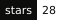](https://github.com/0xNyk/xint-rs/stargazers) |

<b>More open-source repositories</b> - sorted by stars

 

| Project | What it does | Stars |
|---|---|---|
| [builderz-xNFT-scaffold-next](https://github.com/builderz-labs/builderz-xNFT-scaffold-next) | Solana xNFT scaffold (Next.js, TypeScript, Tailwind) | [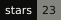](https://github.com/builderz-labs/builderz-xNFT-scaffold-next/stargazers) |
| [solana-claude-md](https://github.com/builderz-labs/solana-claude-md) | Open-source CLAUDE.md pack for Solana program work | [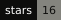](https://github.com/builderz-labs/solana-claude-md/stargazers) |
| [hermes-cf-bypass](https://github.com/0xNyk/hermes-cf-bypass) | Cloudflare TLS fingerprint bypass for Hermes on datacenter VPS | [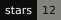](https://github.com/0xNyk/hermes-cf-bypass/stargazers) |
| [unmachined](https://github.com/0xNyk/unmachined) | Anti-AI-slop agent skill - deterministic scanners + severity-tiered tell catalogs for text and UI |  |
| [renaissance-xnft](https://github.com/builderz-labs/renaissance-xnft) | Royalty tracking and redemption for NFT communities |  |
| [silo](https://github.com/0xNyk/silo) | Isolated Claude Code profiles via `CLAUDE_CONFIG_DIR` - personal / work / clients without vault swap | [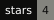](https://github.com/0xNyk/silo/stargazers) |
| [obsidian-curator](https://github.com/0xNyk/obsidian-curator) | Deterministic knowledge-graph maintenance for Claude + Obsidian | [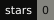](https://github.com/0xNyk/obsidian-curator/stargazers) |
| [homebrew-xint](https://github.com/0xNyk/homebrew-xint) | Homebrew tap for xint and xint-rs |  |

## What I believe

- Infrastructure wins on **latency, reliability, and sharp defaults**.
- Agent teams need **operations**, not demos.
- The strongest stack is **open-core control plane + premium operator UX**.

## Build surface

  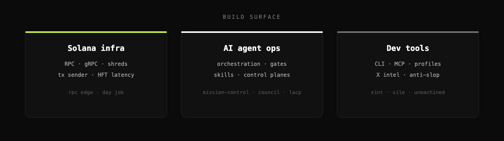

## Connect

| | |
|---|---|
| **Profile** | [github.com/0xNyk](https://github.com/0xNyk) · [nyk.dev](https://nyk.dev) · [@nykdotdev](https://x.com/nykdotdev) |
| **rpc edge** | [rpcedge.com](https://rpcedge.com) · [@rpcedge](https://x.com/rpcedge) · [docs](https://docs.rpcedge.com) |
| **Studio** | [Builderz](https://builderz.dev) · [consulting](https://nyk.dev/consulting) |
